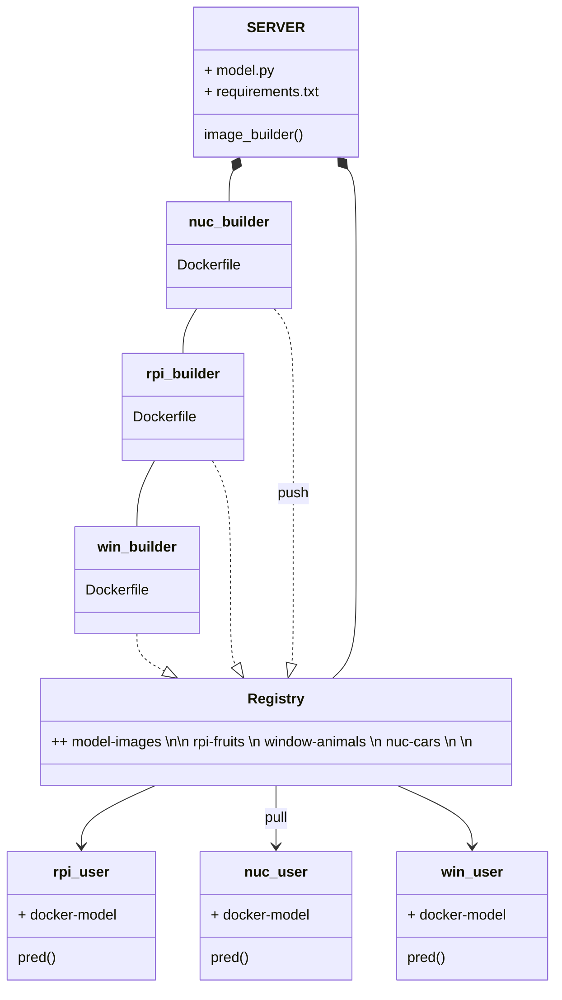
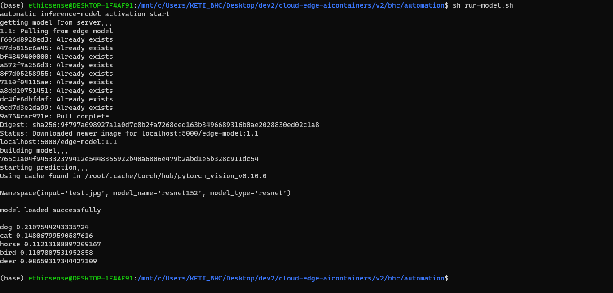
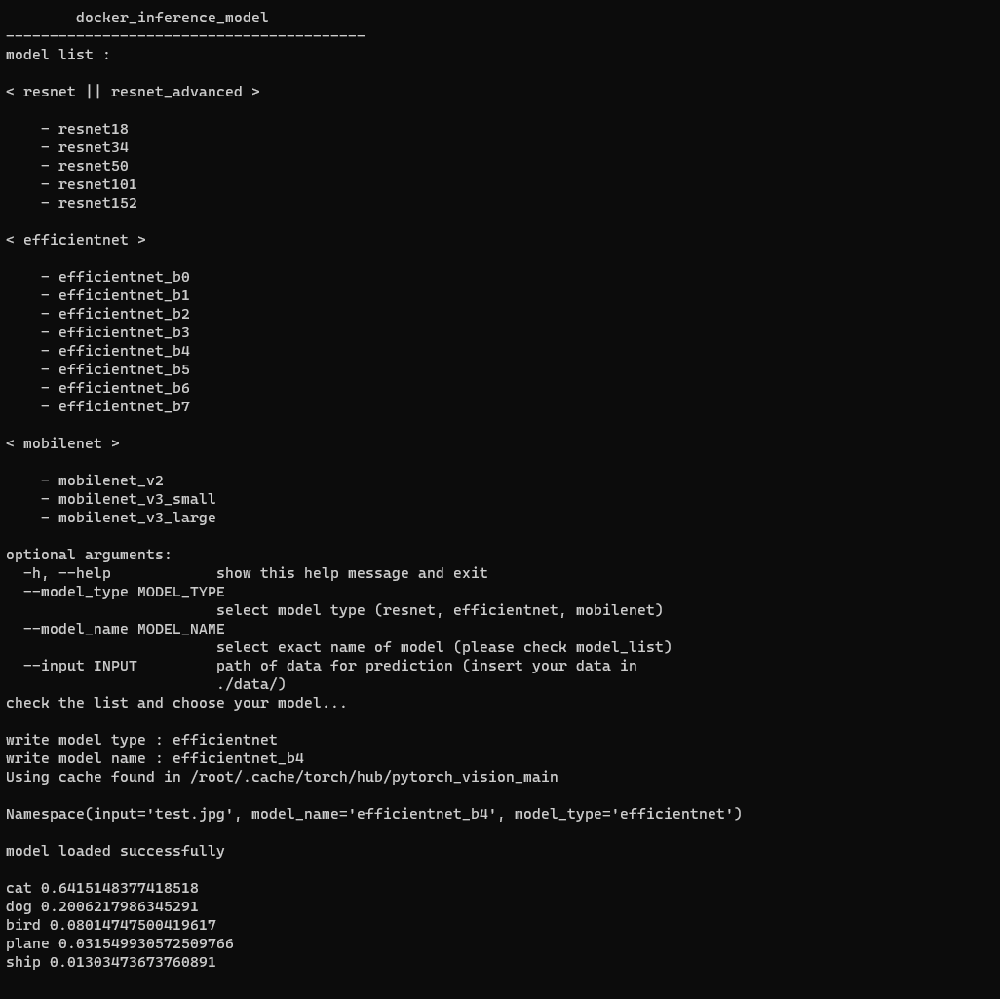
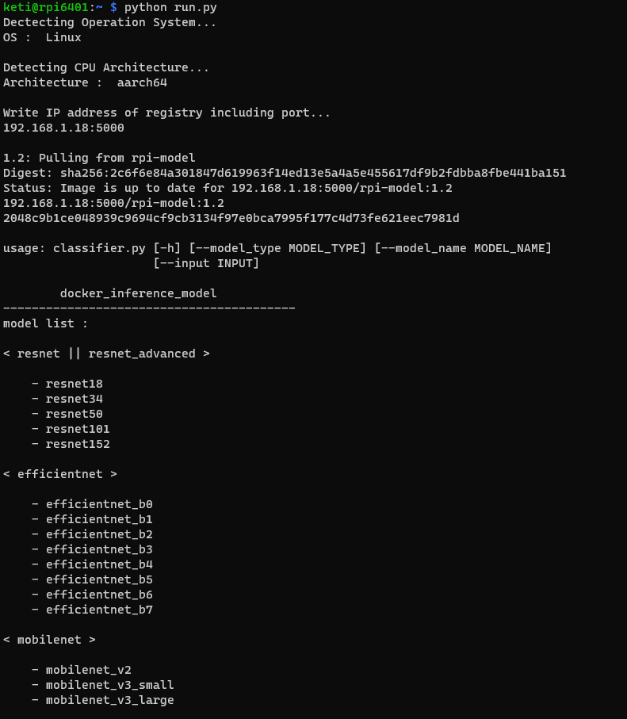
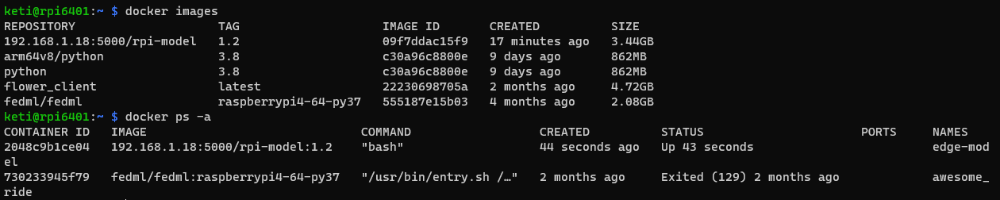

# 모델 자동화 및 사용자화
각 노드가 모델을 구축하고 명령을 수행하는 과정을 간소화, 자동화합니다.<br>
그 외 작업의 편의성을 확보하기 위한 모든 기술과 방법론을 포함합니다.

## ref. pipeline 예상도


## 1. shell script
**docker 명령어 구동 테스트 코드**<br>
```$ sh run-model.sh```<br>
<br>
레지스트리 서버로부터 이미지를 다운로드 받고 컨테이너를 빌드하고 모델 코드를 실행하는 과정을 작성한 스크립트입니다.<br>

  **※ 정상 작동을 위해 모델 코드의 path 단을 수정해야 합니다.**
  ```python
    ## load_model.py
    weights_dir = './home/best_model'
    
    ## classifier.py
    data_path = './home/data/'
  ```
### 수행 절차
- 레지스트리 서버로부터 이미지 풀(pull)
  - ```$ docker image pull```
- 다운로드한 이미지로 컨테이너 생성
  - ```$ docker run```
- 컨테이너의 커널을 통한 작업 명령 수행
  - ```$ docker exec```
### 정상 작동 확인 11/02
로컬 환경에서 실험되었습니다.<br>


## 2. run.py
**필요한 시스템 정보를 불러오고 도커 커맨드를 수행하도록 구성한 python test code**<br>
```python run.py```<br>
<br>
목적 노드의 OS, CPU Architecture 등 환경 요소를 파악하고 적절한 스크립트를 선택적으로 제작해 배급합니다.<br>
ip, model, input 등 인자를 전달 받아 수행 절차를 구체화하는 과정을 포함합니다.<br>
<br>
### 구성
- 노드 os 및 cpu architecture 탐지
- 입력 받기
 - model config
 - data config
- 스크립트 생성 및 전달
- 결과 출력

### 실행 결과

#### pc node (windows 10 -> wsl2(linux x86_64), intel amd64)



#### rpi node (debian linux, arrch64/v8)



#### 코드 실행 후 docker image | container list

