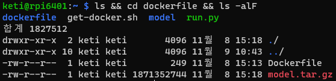
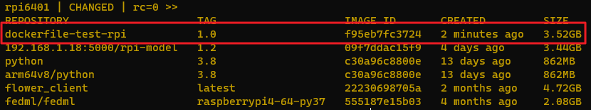
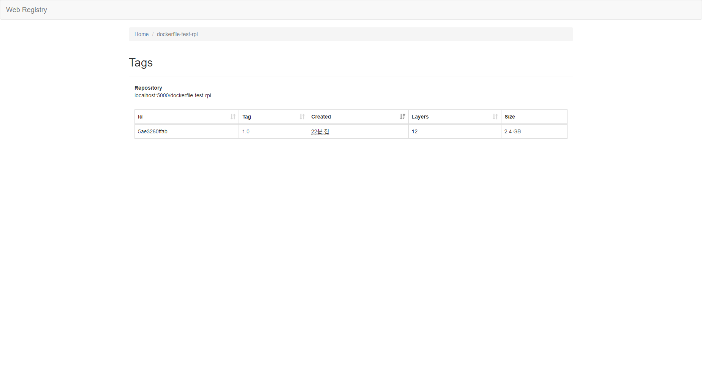
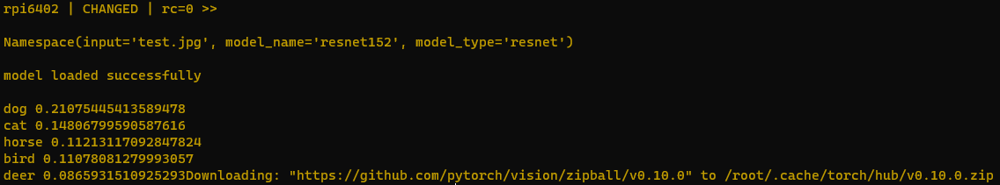

## 1. 도커 명령 수행 테스트
ansible을 통해 원격의 노드에 일련의 작업 명령을 전달하고 수행하는 절차를 구체화하고 발생되는 문제점을 해결합니다.<br>

### 테스트 목록
- dockerfile image build
- run container
- model inference
- push image to registry
- pull image to registry
<br>
>이후 ansible-playbook의 모듈을 활용한 스크립트 제작 예정입니다.<br>
<Br>

### 빌더-노드 세팅
builder로 사용될 노드는 Dockerfile과 model.tar.gz를 보유하고 있습니다.<br>
<br>
model 파일은 추후 별도의 웹 서버로 관리할 수 있습니다.<br>
새로운 모델을 기반으로 이미지를 구축하고자 할 때 더욱 편리할 것입니다.

### 테스트 수행
ansible 명령은 다음과 같은 형태입니다.
```bash
$ ansible {host_name} -m command -a "{cmd}"
```
host_name은 /etc/ansible/hosts에 명시합니다.<br>
cmd는 shell 명령을 동일하게 입력합니다.<br>
<br>

#### build test
```bash
$ ansible rpi6401 -m command -a "docker build --tag dockerfile-test-rpi:1.0 dockerfile/"

## check result
$ ansible rpi6401 -m command -a "docker images"
```


#### run test
```bash
## run container
$ ansible rpi6401 -m command -a "docker run -d --name test-model -it dockerfile-test-rpi:1.0"

## run model
$ ansible rpi6401 -m command -a "docker exec test-model python home/classifier.py"
```


#### push test
```bash
## rename image
$ ansible rpi6401 -m command -a "docker tag dockerfile-test-rpi:1.0 192.168.1.18:5000/dockerfile-test-rpi:1.0"

## push
$ ansible rpi6401 -m command -a "docker push 192.168.1.18:5000/dockerfile-test-rpi:1.0"
```


#### pull test
user node에서 원하는 모델을 불러와서 구동하는 상황을 가정합니다.<br>
- USER_HOST : rpi6402
```bash
## pull
$ ansible rpi6402 -m command -a "docker pull 192.168.1.18:5000/dockerfile-test-rpi:1.0"

## run container
$ ansible rpi6402 -m command -a "docker run -d --name test -it 192.168.1.18:5000/dockerfile-test-rpi:1.0"

## run model
$ ansible rpi6402 -m command -a "docker exec test python home/classifier.py"
```


<br><br><br>
연동성 확보를 위한 작업 중입니다. ```2022.11.10```<br>
ansible-playbook 모듈을 활용한 스크립트 테스트 작업 중입니다. ```2022.11.10```

## 2. ansible-playbook script 작성
ansible command를 수행하는 스크립트를 작성합니다.<br>
여러 기능을 통해 절차를 간소화할 수 있습니다.

### 2-1. docker_list.yaml
docker images | docker ps -a | docker ps 명령을 수행하는 스크립트입니다.<br>
도커 이미지와 생성된 컨테이너 리스트를 출력합니다.

### 2-2. build_image.yaml
docker build 명령을 수행하는 스크립트입니다. Dockerfile로 정의된 이미지를 구축합니다.<br>
정상 작동 여부를 확인하기 위해 docker images로 결과를 확인합니다.

### 2-3. test_model.yaml
docker run | docker exec 명령을 수행하는 스크립트입니다.<br>
컨테이너를 생성하고 컨테이너에 작업 명령을 전달합니다.

### 2-4. push.yaml
docker tag | docker push 명령을 수행하는 스크립트입니다.<br>
레지스트리에 업로드할 수 있는 형태로 이미지의 이름을 변경한 뒤 레지스트리에 해당 이미지를 업로드합니다.<br>
정상 작동 여부 확인을 위해 curl 명령을 통해 레지스트리 리스트를 출력합니다.

## 3. playbook 고도화

### 3-1. autorun.yaml
필요한 절차를 통합한 playbook입니다.<br>
../에 업로드 되었습니다.
