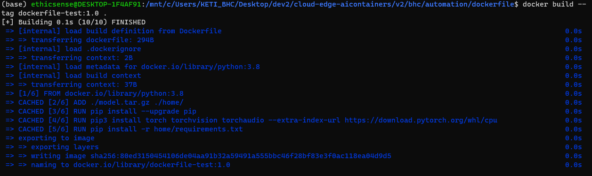
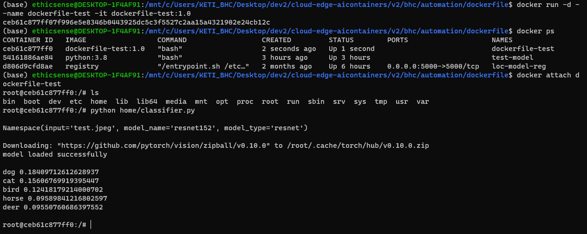

## dockerfile
새로운 노드와 호환, 다른 종류의 모델이 요구될 때 자동으로 이미지를 구축하기 위한 image build 용 스크립트입니다.<br>

### 스크립트 구성
- base image 호출
- model download
- packages installation

>**ADD command**<br>
>모델을 다운로드 후 컨테이너 내부에 자동으로 압축을 해제하기 위해 반드시 tar 모듈을 이용해 .tar.gz 포맷으로 압축해야 합니다.<br>
<br>

### 스크립트 실행
Dockerfile과 model.tar.gz가 위치한 경로에서 수행합니다.<br>
```bash
$ docker build --tag dockerfile-test:1.0 .
$ docker run -d --name dockerfile-test -it dockerfile-test:1.0
$ docker exec dockerfile-test python home/classifier.py
```
### 실행 결과


