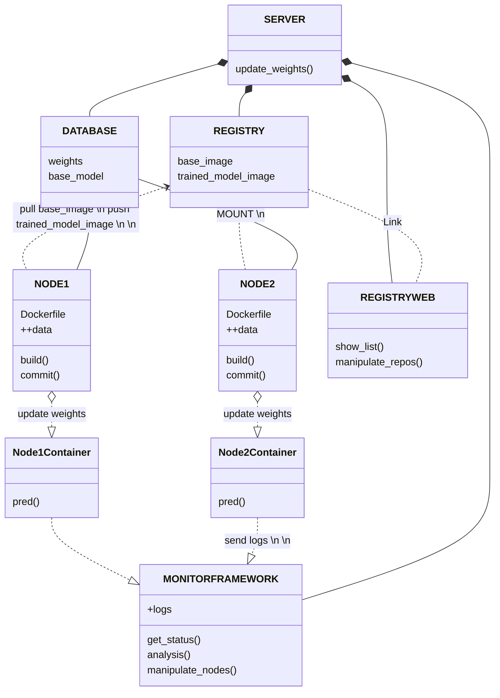

# 모델 배포를 위한 사설 레지스트리 구축 및 배포 방안에 관하여
AI 추론 모델을 서버로부터 각 노드에 배포하기 위한 여러 방법론에 관한 내용입니다.

## Docker Registry
도커 레지스트리 서버 컨테이너를 빌드한 후 배포하고자 하는 이미지를 레포지토리로 생성합니다.<br>
각 노드의 도커를 통해 해당 레지스트리에 접근해 이미지를 받아오고, 또 올릴 수 있습니다.

### image
```bash
## 배포하고자 하는 컨테이너를 이미지화 합니다.
# commit : 컨테이너의 수정 사항 및 현 구성 그대로 이미지를 생성
docker commit -a "bhc" -m "commit new env" egde_infer edge_model:v1.0

# >> dockerfile.tar 생성됨
```

### registry container

#### build
```bash
## docker hub에서 registry image를 먼저 다운로드 받으세요.
docker run -d -p 5000:5000 --restart always --name registry registry:2
```

#### push
```bash
## registry 배포용 이미지 생성
# 이름 앞에 레지스트리 url:port를 붙여주시면 됩니다.
docker tag edge_model:v1.0 localhost:5000/edge_model:v1.0

## push
docker push localhost:5000/edge_model:v1.0

## check image list
curl -X GET http://localhost:5000/v2/_catalog
>> {"repositories" : ["centos_test", "edge_model"]}

## check tags list in a repo
curl -X GET http://localhost:5000/v2/$repo_name/tags/list
>> {"name" : "edge_model", "tags" : ["v1.0"]}
```

#### pull
```bash
## pull image from registry
docker image pull localhost:5000/edge_model:v1.0

## build container
docker run -it localhost:5000/edge_model:v1.0
```


### Registry-WEB
기본적인 레지스트리 컨테이너는 시각화를 지원하지 않기 때문에 curl 명령 등을 통해 탐색해야 하는 불편함이 있습니다.<br>
레지스트리 컨테이너와 링크되어 작동하는 레지스트리 GUI 웹 컨테이너를 사용하여 시각화를 개선합니다.

#### hyper
```bash
## 개인이 레지스트리 시각화를 위해 구현한 도커이미지입니다.

## pull image
docker pull hyper/docker-registry-web

## build container
# 포트번호 바꾸면 작동 안함
docker run -it -p 8080:8080 --name registry-web \
--link loc-model-reg \
-e REGISTRY_URL=http://loc-model-reg:5000/v2 \
-e REGISTRY_NAME=localhost:5000 hyper/docker-registry-web
```

## Distribution
도커를 활용하여 다양한 방식으로 모델을 배포할 수 있습니다.<br>
작업 내용들을 바탕으로 모델 배포 파이프라인의 예상도를 도식화합니다.<br>


