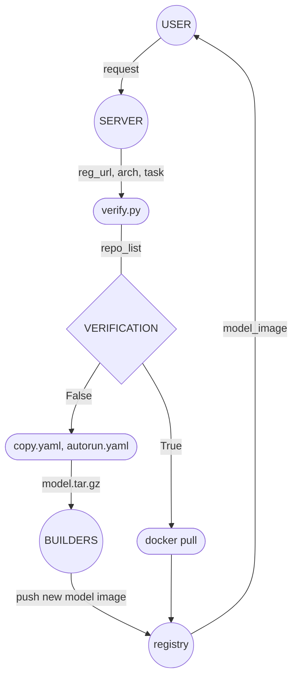

# Advanced model distribution
모델 존재 여부 검증 및 상황에 맞는 스크립트 전달 및 수행

## verify.py
```bash
python verify.py --url {} --arch {} --task {}
```
url, cpu architecture, task 등 정보를 통해 registry의 이미지 목록을 조회하고 모델 존재 여부를 확인하는 코드입니다.
* url : 레지스트리 서버의 주소
* arch : 모델을 사용하고자 하는 노드의 cpu architecture 정보. ```uname -a```를 통해 조회할 수 있습니다.
* task : 모델을 통해 수행하고자 하는 작업 ( ex. 과일을 분류하고자 함 => fruits )
  > task 명시에 대한 정의는 재점검이 필요합니다.
  
## gui
>- 모델 조회, 배포 절차 수행 등에 있어 모두 코드 및 스크립트 단위로 수행하는 것은 번거롭습니다.<br>
>- CS 지식이 전무한 일반인( ex. 모델을 배포받아 사용하고자 하는 사용자 )의 경우 사용 자체가 불가능할 수 있습니다.<br>
>- 작업자의 입장에서도 조금 더 좋은 가독성을 가진 형태로 구축하기를 희망합니다.

정보 | 결과를 간결하게 조회할 수 있는 인터페이스를 구현하고, 배포 및 테스트 등 필요한 기능을 바로 수행할 수 있도록 인터페이스와 연결하여 하나의 어플리케이션 형태로 개발하고자 합니다.<br>

### 어플리케이션 수행 기능
- 레지스트리 목록 조회
  - list 형태로 출력
- 모델 중복 여부 검증
  - 중복 bool 출력 및 다음 절차로 유도
- 모델 구축, 배포 절차 수행
  - build
  - push
  - pull
- 모델 테스트 수행
  - run
  - exec (pred)

### REF. 구축 · 배포 전(全) 과정 흐름 도식

