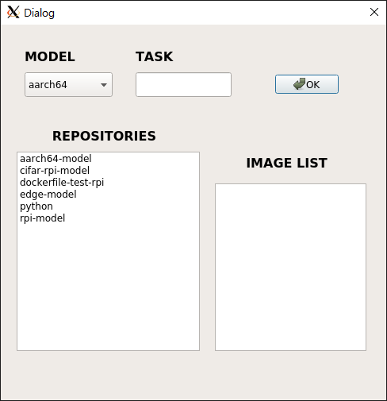
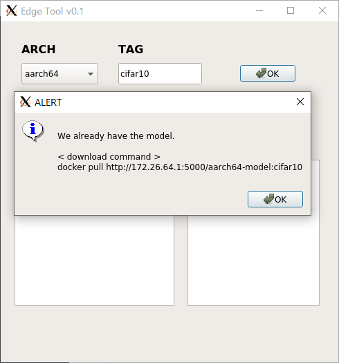
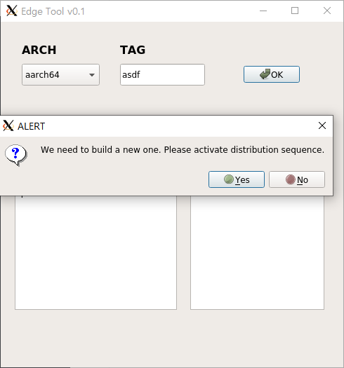
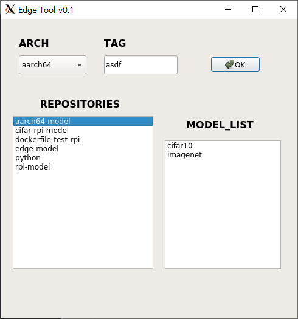
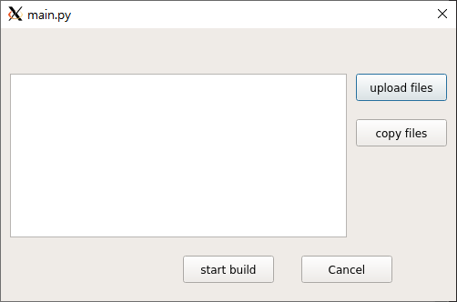
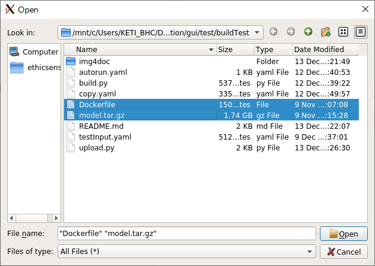
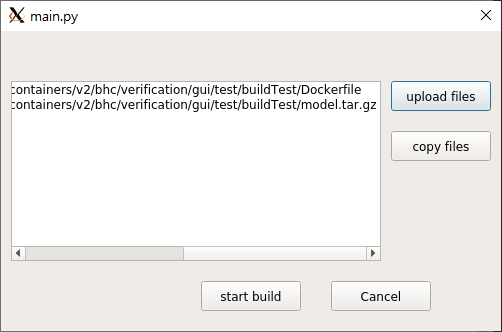

# 그래픽 사용자 인터페이스 개발
**사용자 인터페이스를 통한 조회, 배포 등 조작, 정보 및 결과 조회**<br>

### 조회 정보 | 수행 명령
> 실제 코드와 커맨드는 달라질 수 있습니다.<br>
- registry list
  - curl
- model existance verification
  - curl | grep
  - return boolean
- model build | distribution
  - if True : pull
  - if False : build && push && pull
- test model prediction
  - run
  - pred()

## PyQt5
GUI programming을 지원하는 python 라이브러리입니다.<br>

### VcXsrv
Linux 환경의 경우(WSL 포함) GUI Display를 기본적으로 연결해주지 않기 때문에 GUI를 지원하는 가상 서버 어플리케이션을 설치합니다.<br>
<br>
> **install VcXsrv**<br>
> https://sourceforge.net/projects/vcxsrv/

installation 수행 후
```bash
$ export DISPLAY=$(cat /etc/resolv.conf | grep nameserver | awk '{print $2}'):0

## VcXsrv 재실행 ( window 환경에서 ) ( 실행 시 additional parameter "-ac" 확인 )

## wsl 재실행 ( powershell에서 )
$ wsl --list --verbose
$ wsl --shutdown Ubuntu-20.04

## test VcXsrv
$ xeyes
```

### Qt Designer
**PyQt GUI 레이아웃 편집기**<br>
.ui 포맷(XML 문서)으로 저장하여 불러와 사용하거나 .py 포맷으로 변환하여 사용할 수 있습니다.<br>
```bash
## python 파일로 변환
python -m PyQt5.uic.pyuic -x test.ui -o test.py
```

## test
PyQt5의 클래스 구조와 기능 구현에 필요한 내용 이해를 위해 테스트중인 코드입니다.<br>
> 지속 테스트 작업 중에 있습니다.

## main.py
demonstration application의 메인 화면으로 사용될 예정인 GUI 레이아웃입니다.<br>
테스트 기능들과 기타 인터페이스를 전체 연동했습니다.<br>

### 초기화면 구축 ```class Main()```

#### 레이아웃


#### ```TAG```
존재하는 모델 입력 시 docker pull 명령어를 보여줍니다.<br>

<br>

미존재 모델 입력 시 배포 기능 수행 여부를 묻습니다.<br>


#### ```REPOSITORIES```
Registry Server에 존재하는 레포지토리 목록( == image_names list )를 띄웁니다. (requests 모듈 활용)<br>


### 배포 기능 수행 화면 ```class BuildWindow```

#### 레이아웃


#### ```upload files```
QFileDialog 메서드를 활용하여 파일을 탐색 업로드하는 기능입니다.<br>


화면에 선택한 파일의 경로가 QListView로 보여집니다.<br>


#### ```copy files```
**ansible-playbook copy.yaml** script를 동작합니다.<br>

#### ```start build```
**ansible-playbook autorun.yaml** script를 동작합니다.<br>

#### ```Cancel```
```self.close()```<br>
Main 화면으로 돌아갑니다.<br>


> 지속 고도화 작업 중에 있으며 레이아웃 및 화면 구성은 변경될 수 있습니다.

## ui2py.py
```bash
$ python -m PyQt5.uic.pyuic -x {name.ui} -o {name.py}
```
Qt designer로 작성된 .ui 파일을 python 포맷으로 변환하는 작업을 테스트한 코드입니다.<br>
레이아웃 수정 및 기능 고도화 등 작업이 오히려 번거로워져 실제 사용에는 어려움이 있습니다.<br>
전체 레이아웃 구성을 Qt designer로 구현하여 작업할 경우 코드를 간소화할 수 있는 이점이 있습니다.
