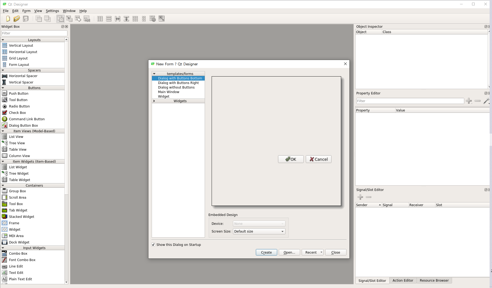
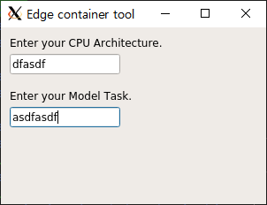
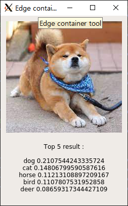
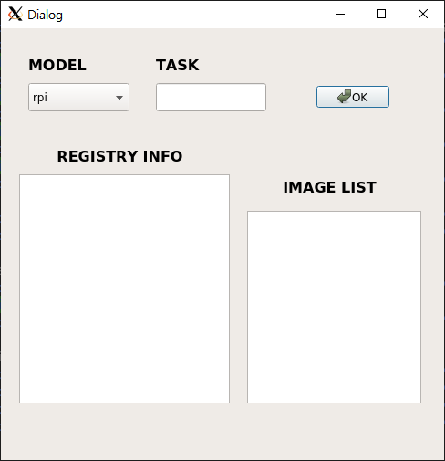
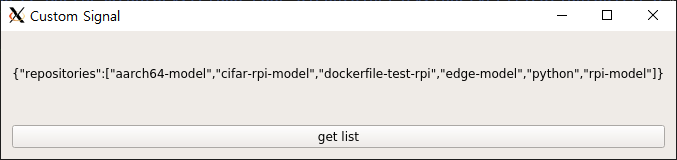
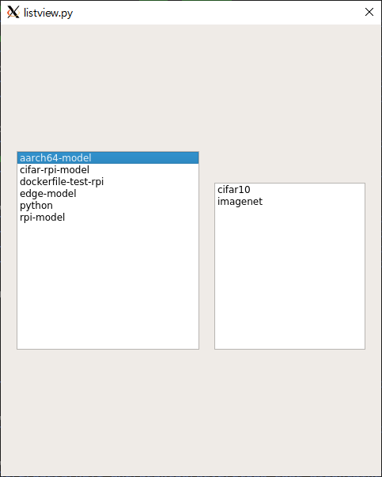
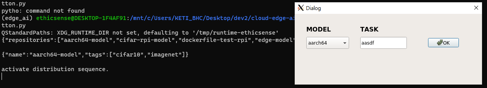

# GUI programming test code

## buildTest
**모델 구축 및 배포 기능과 GUI를 연결하기 위한 테스트, 작업 내용입니다.**<br>
ansible-playbook script 파일을 python에서 os.system을 이용해 builder-nodes에 전달 및 수행합니다.<br>
학습 모델 압축파일 등 필요한 파일 불러오기, 인자 변경 및 전달 등 기능이 추가될 예정입니다.<br>
<br>
상세 내용을 ```buildTest/``` 내부에 기재합니다.


## PyQt5 test
**클래스 구성, 생김새, 동작 방식 등 테스트를 위한 코드들입니다.**

### ```EdgeTool.ui```
Qt Designer 편집기를 활용하여 작성한 레이아웃 XML 문서입니다.
>**초기화면**


### ```Input.py```
사용자가 정보를 입력하여 전달할 수 있는 텍스트박스 구현 테스트 코드입니다.
>

### ```ShowImage.py```
모델 테스트 시 테스트용 이미지 원본과 예측 결과를 한번에 출력할 수 있도록 구성한 테스트 코드입니다.
>

### ```callui.py```
편집기를 통해 작성한 XML 문서를 불러와 실행하는 코드입니다. ```EdgeTool.ui```를 불러옵니다.
>

### ```signal.py```
어플리케이션의 동작을 정의하고 인터페이스와 연결하는 과정에 대한 테스트 코드입니다.
>

### ```listview.py```
레지스트리 서버의 모델 목록 송출 테스트 코드입니다.
>

### ```vrfbutton.py```
모델 존재여부 검증 기능 테스트 코드입니다.
>
