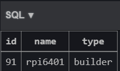
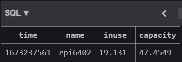
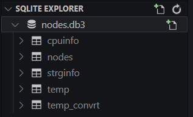

# 데이터 생성, 조작 및 DB 구축
개별 엣지 노드 모니터링, 구축된 모델 배포 및 추론 성능 분석, 시스템 이상징후 탐지 등의 목적으로 다양한 데이터를 생성, 수집, 보관해야 합니다.<br>
다양한 방법, 기술을 통해 데이터를 생성하고 보관하는 실험을 수행합니다.<br>
구축된 데이터를 grafana와 연결하여 시각화하는 방안을 함께 모색합니다.

## 개별 엣지 노드 정보 추출 및 시각화

### 호스트 정보 from ```hosts/hosts.py```
>ansible hosts 파일에 명시된 등록된 사용자 정보를 파싱하여 DB에 저장합니다.<br>
>Table panel을 활용하여 목록을 시각화합니다.



#### ansible inventories file
```../edge-hosts.ini``` 참조

### 온도 정보 from ```temperature/get_temp_db.py```
>커널로부터 시스템 정보를 출력하는 명령어를 통해 시스템의 온도 센서 데이터를 출력합니다.<br>
>시간 정보를 추가합니다.<br>
>목적에 맞게 가공하여 DB로 저장, 시각화합니다.


#### 온도정보 검출 명령어 (조금씩 다를 수 있습니다.)
```bash
$ cat /sys/devices/virtual/thermal/thermal_zone0/temp
```
출력된 온도 정보는 Kelvin 단위입니다. Celsius로 환산해줍니다.
```python
output = round(output / 10 - 273.15, 2)
```

#### 시간 정보
사용 중인 시각화 툴 grafana에서는 sqlite3 db 사용 시 두 가지 시간 포맷에 대한 데이터 변환을 지원합니다.
* unix timestamp
* RFC 3339
<br>
비교적 쉽게 활용할 수 있는 unix timestamp를 활용했습니다.

```python
import time

now = round(time.time())
```


### cpu 사용률 정보 from ```sysinfo/get_sysinfo_db.py```

```python
def get_cpurat_data():
```

>커널 명령을 통해 시스템 정보 중 cpu 사용률에 대한 정보를 출력합니다.<br>
>ansible-playbook 작성을 통해 커맨드를 관리합니다.<br>
>데이터를 파싱하여 DB 저장, 시각화합니다.<br>
>시간 정보를 포함합니다.


#### cpu usage 확인 명령어
```bash
top -b -n1 | grep -Po '[0-9.]+ id'
```


### 스토리지 잔여 용량 from ```sysinfo/get_sysinfo_db.py```

```python
def get_storage_data():
```

>커널 명령을 통해 디스크의 용량 정보를 출력합니다.<br>
>ansible-playbook으로 커맨드를 관리합니다.<br>
>시간 정보를 포함하여 정제 및 저장, 시각화합니다.



#### command line
```bash
df -P | grep -v ^Filesystem | awk '{sum += $4} END { print sun/1024/1024 }
```
{sum += $x}의 필드값을 변경하면 총 용량, 사용 중 용량, 잔여 용량을 각각 확인할 수 있습니다. (```db/sysinfo/sysinfo.yaml``` 참조)

### 위치 정보 from ```geoloc/get_geoloc_db.py```
>입력된 한글 주소를 위치 정보(위도, 경도)로 변환합니다.<br>
>위·경도 정보를 토대로 지도에 해당 위치를 표시합니다.


#### geopy
파이썬 지오코딩 라이브러리 geopy의 기능을 사용합니다.
```python
from geopy.geocoders import Nominatim

geolocoder = Nominatim(user_agent = 'South Korea', timeout=None)
geo = goelocoder.geocode(address)
crd = {'lat':geo.latitude, 'lng':geo.longitude}

print(crd['lat'])
print(crd['lng'])
```
자세한 내용은 공식 문서에서 확인할 수 있습니다.<br>
* [Geopy Docs](https://geopy.readthedocs.io/en/stable/)

## DB 현황
> 지속 업데이트 예정



