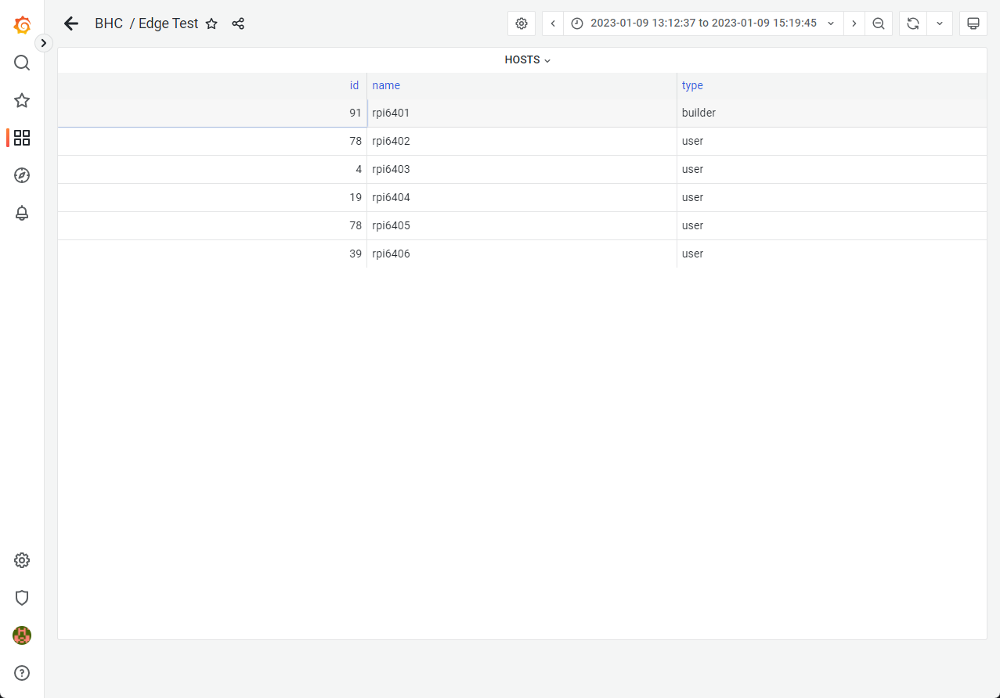
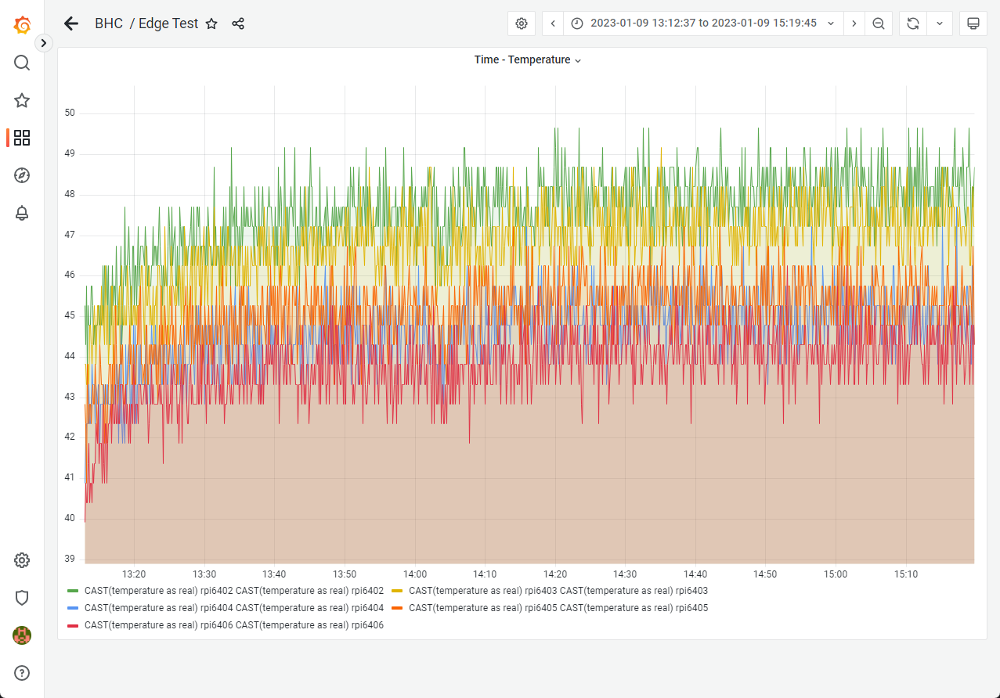
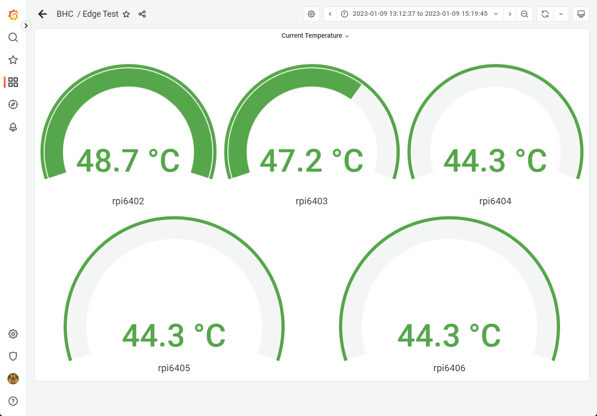
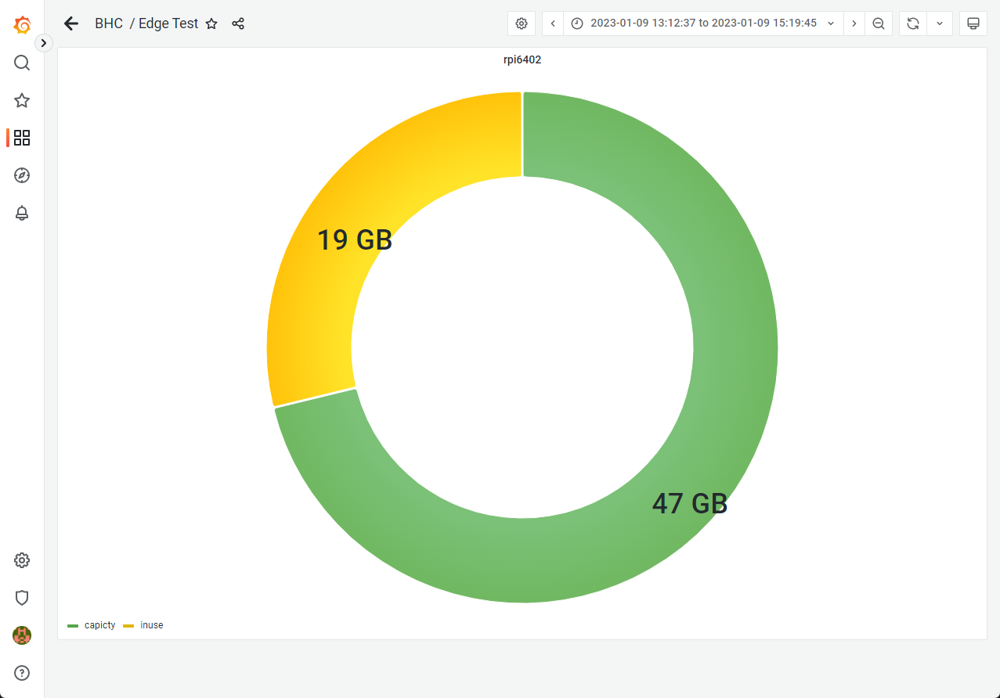
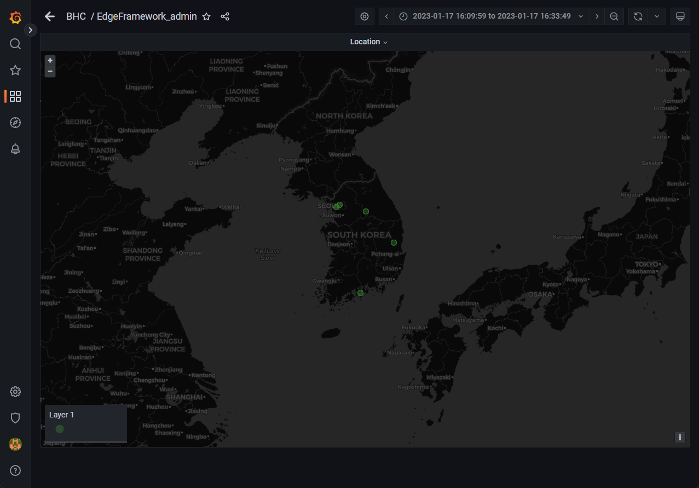

# Grafana : 시각화 웹 애플리케이션 구축
data source를 연결하여 다양한 대시보드를 통해 시각화하는 툴입니다.<br>
구축한 데이터베이스 파일을 연결하여 데이터 포맷과 수집 목적에 맞는 방식으로 시각화하고 분석하는 방안을 제시합니다.<br>
자체 프레임워크 제작을 위한 환경 구성에 대한 내용을 포함합니다.

## Start Grafana

### installation
ubuntu 20.04 기준 설치 방법입니다<br>
```bash
sudo apt-get update && sudo apt-get upgrade -y
sudo apt-get install -y apt-transport-https
sudo apt-get install -y software-properties-common wget
wget -q -O - https://packages.grafana.com/gpg.key | sudo apt-key add -
echo "deb https://packages.grafana.com/oss/deb stable main" | sudo tee -a /etc/apt/sources.list.d/grafana.list
sudo apt-get update
sudo apt-get install grafana
```

### start grafana
```bash
sudo service grafana-server start
```
3000번 포트로 연결됩니다.<br>
>**Default 계정**
>- username : admin
>- password : admin

## Panel Test

### Table - hosts
Table panel을 테스트했습니다.<br>
ansible inventory에 등록된 hosts 정보를 출력합니다.

#### Query
```sql
select * from nodes;
```

#### Result


### Time Series - Temperature
time series panel을 테스트했습니다.<br>
노드 별 시간 단위 온도 정보를 출력합니다.

#### Query
>쿼리 입력부 하단 ```Format as```를 Time series로 변경해야 합니다.<br>
>```Time formatted columns```에 시간 컬럼명을 태그로 추가해야 합니다.

```sql
select time, CAST(temperature as real), name from temp_convrt;
```

#### Result


### Gauge - Temperature
gauge panel을 테스트했습니다.<br>
현재 온도 정보를 게이지로 출력합니다.

#### Query
```sql
select CAST(temperature as real), name from temp_convrt where name = 'rpi6402' order by ROWID desc limit 1;
```

>쿼리를 노드 수만큼 추가해야 합니다. ```where name = '{node_name}'```

#### Result


### Time Series - CPU Usage
time series panel을 테스트했습니다.<br>
노드 별 시간 단위 cpu 사용률에 대한 정보를 출력합니다.

#### Query
>상기 time-temperature과 세팅은 동일합니다.

```sql
select time, 100-CAST(cpuratio as real), name from cpuinfo;
```

>사용률 정보는 idle status(유휴 상태)가 출력되기 때문에 100에서 idle percent를 빼줍니다.

#### Result


### Pie Chart
pie chart panel 테스트했습니다.<br>
물리 디스크의 사용 중 용량, 잔여 용량 정보를 출력합니다.

#### Query
>Standard options tab에서 Unit에 단위를 추가할 수 있습니다.

```sql
select CAST(capacity as real) as capicty, CAST(inuse as real) as inuse, name from strginfo where name = 'rpi6402' order by ROWID desc limit 1;
```

#### Result


### Clock
clock panel을 테스트했습니다.<br>
현재 시간을 출력합니다.

#### Result
>별도의 쿼리가 없습니다.


### Time-series - Memory Usage
time series panel을 활용한 메모리 사용률 정보 시각화입니다.<br>
난 노드의 메모리 사용률 변화를 출력합니다.

#### Query
```sql
select time, name, CAST(memratio as real) from meminfo;
```

#### Result


### Map - Location
map panel을 활용하여 노드의 위치 정보를 시각화합니다.<br>
한글 주소를 미리 입력받고 주소를 위도, 경도값으로 변환하여 지도에 해당 위치를 표시합니다. (python geopy)

#### Query
```sql
select CAST(latitude as real) as lat, CAST(longitude as real) as lng, name from location;
```

#### Result

