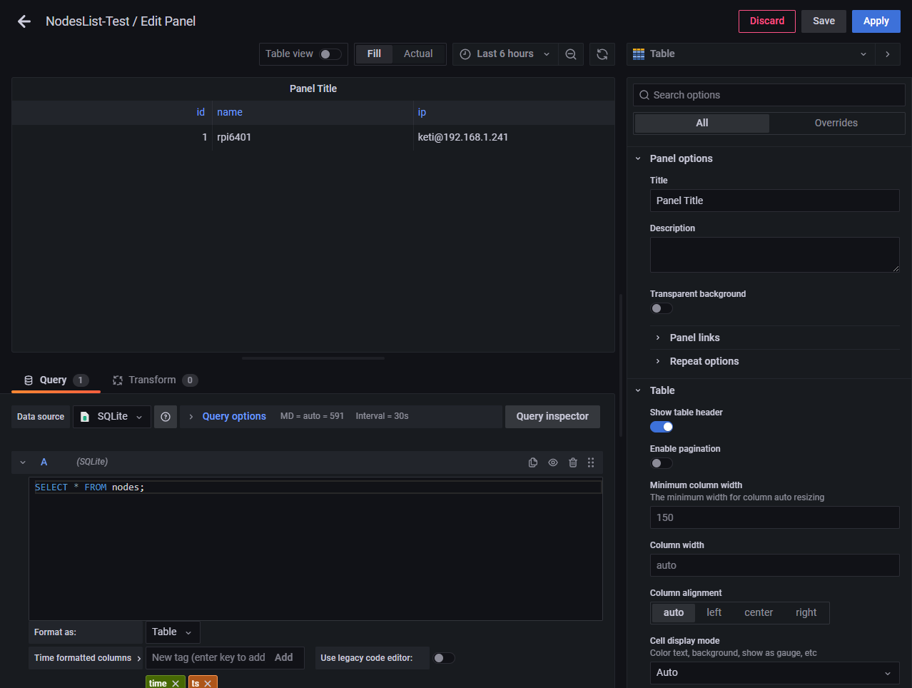

# Grafana : 시각화 웹 애플리케이션 구축
data source를 연결하여 다양한 대시보드를 통해 시각화하는 툴입니다.<br>
구축한 데이터베이스 파일을 연결하여 데이터 포맷과 수집 목적에 맞는 방식으로 시각화하고 분석하는 방안을 제시합니다.<br>
자체 프레임워크 제작을 위한 환경 구성에 대한 내용을 포함합니다.

## Start Grafana

### installation
ubuntu 20.04 기준 설치 방법입니다<br>
```bash
sudo apt-get update && sudo apt-get upgrade -y
sudo apt-get install -y apt-transport-https
sudo apt-get install -y software-properties-common wget
wget -q -O - https://packages.grafana.com/gpg.key | sudo apt-key add -
echo "deb https://packages.grafana.com/oss/deb stable main" | sudo tee -a /etc/apt/sources.list.d/grafana.list
sudo apt-get update
sudo apt-get install grafana
```

### start grafana
```bash
sudo service grafana-server start
```
3000번 포트로 연결됩니다.<br>
>**Default 계정**
>- username : admin
>- password : admin

### Panel Test
Table pannel을 테스트했습니다.<br>

