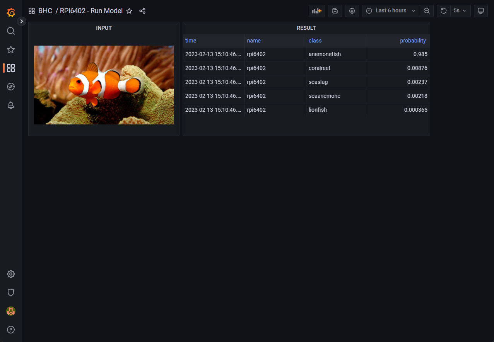

# 모델 추론 결과 모니터
컨테이너에서 수행한 추론 대상과 추론 결과를 볼 수 있습니다. 
 

## input
모델의 추론 대상 데이터(이미지, 텍스트 etc.)를 보여줍니다. 
 
dynamic image panel로 구현되었습니다. 
 
apache server에 대상 데이터가 저장되며 url + path 정보를 통해 대상 이미지를 불러옵니다. 
최근 업데이트된 이미지를 불러옵니다. 

- **name_node** 
  모델을 실행한 노드의 이름
  
- **name_img** 
  추론 대상 데이터의 이름

## result
추론을 수행한 결과를 시각화합니다. 
 
table panel로 구현되었습니다. 
 
분류 문제에서 top5 classes 에 대한 확률값입니다. 
가장 최근 수행된 추론 결과에 대한 데이터를 불러옵니다. 

- **class** 
  모델이 예측한 category 정보

- **probability** 
  해당 category 에 속할 확률
