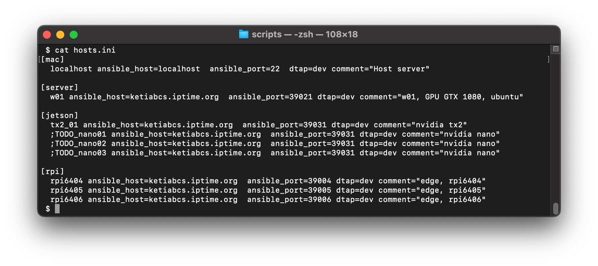
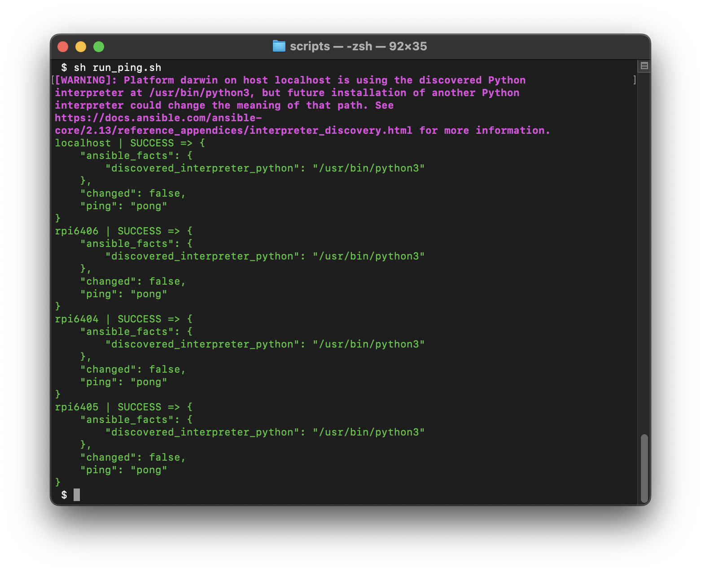
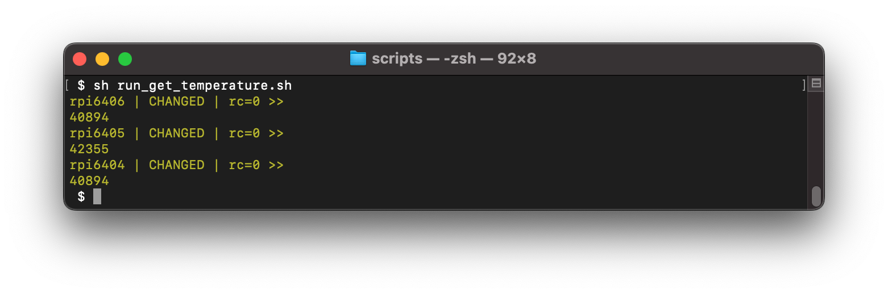
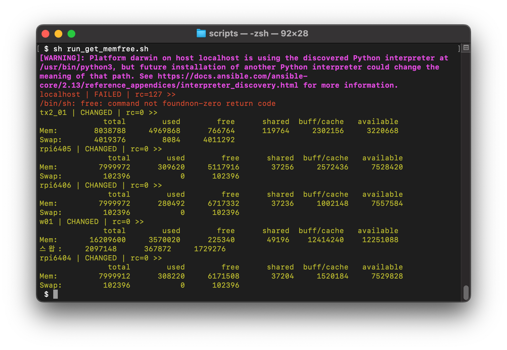

# 분산학습 이기종 엣지 기기 지원, KAIST 연합학습 지원

## 문서의 개요
---------------------------------------------------
- 본 문서에는 EdgeAI 과제에서 분산학습 이기종 엣지 기기 연동 및 KAIST-KETI 간 연합학습 관련 실험지원 내용을 정리합니다.
- [3. 자원제약형 모델학습 정확도 향상률 : 6%] 은 공인시험평가 항목입니다. 다수의 기기가 서로 연동하여 객체이미지의 분류 정확도를 개선하는 학습을 수행합니다.
- [5. 분산학습 이기종 엣지 기기 지원 : 4종]은 자체 평가 항목입니다. 2022년에는 4종의 서로 다른 이기종 엣지 기기가 연동하여 실험을 수행합니다.
- 상기 3번 항목이 달성되면, 5번 항목이 자연스럽게 달성되도록 하는 것이 바람직합니다.


## 참고할 평가환경 구성
---------------------------------------------------
- KAIST-KETI-ETRI와의 회의 내용을 기반으로 KETI에서 작성한 초안이며, 참고용입니다. 
- KAIST와 KETI가 향후 의견 조율을 통해 개선될 예정입니다.


### 사용할 Dataset
---------------------------------------------------

- https://www.cs.toronto.edu/~kriz/cifar.html

- Cifar10 : 32x32 컬러 이미지, 10개의 분류객체, 클래스당 6000장(5000장 학습, 1000장 시험), 총 60000장(50000장 학습셋 + 10000장 시험셋)

- Cifar100 : 32x32 컬러 이미지, 100개의 분류객체, 클래스당 600장(500장 학습, 100장 시험), 총 60000장(50000장 학습셋 + 10000장 시험셋)


### HW 환경 구성 (KETI의 예시)
---------------------------------------------------

- 메인 서버 : 
  . {MacbookPro14 or Desktop PC}

- 에지 디바이스 : 
  . 현재 구성된 디바이스 {RTX3080ti, RPI, TX2 8G}
  . 진행 중인 디바이스 {NANO 4G, MacMini, ???}


### SW 환경 구성 (KETI 예시)
---------------------------------------------------

#### (1) 메인 서버와 에지 디바이스에 Ansible 설치

- 메인 서버에서 에지 디바이스를 제어, 관리, 모니터링 하기 위한 용도입니다.
- 아직 시각화서버(GUI서버)와 미연동 상태(개발중)입니다.

```bash
  # pip로 설치하는 방법입니다.
  $ pip install ansible
  
  # or 설치 할 앤서블 버전 설정
  $ pip install ansible==2.10.7

  # or conda로 설치 할 수 있습니다.
  $ conda install ansible

  # or ubuntu에서는 apt-get으로 설치할 수 있습니다.
  $ sudo apt install ansible

  # MacOS에는 brew로 설치할 수 있습니다.
  $ brew install ansible
```

#### (2) 메인 서버에서 에지 서버에 접속하기 위한 공개키를 생성하고 등록

- 메인 서버에서 에지 서버를 제어 및 모니터링 하려면 ssh 채널을 사용합니다.
- 암호 입력과정을 생략하고, 주기적인 모니터링을 위해 다음과 같은 처리를 수행합니다.

   1. 메인 서버는 RSA 방식으로 공개키(대칭암호화)를 생성합니다.

   2. 이를 각각의 에지 디바이스에 전송하여, ~/.ssh/authorized_keys 파일에 등록합니다.


#### (2-1) 아래와 같은 절차에 따라 상기 과정을 수행할 수 있습니다.

- 단계 1. ssh-keygen으로 RSA 방식의 비밀키, 공개키 쌍을 생성합니다.
- 단계 2. ssh-copy-id로 메인 서버에서 생성한 공개키를 에지 디바이스로 전송 및 복사합니다.
- [주의] RSA 방식으로 키를 생성하면, 비밀키(개인키)와 공개키가 생성됩니다. 공개키는 말 그대로 공개가 가능하지만, 비밀키(개인키)는 절대 유출되면 안됩니다.


#### (2-2) 공개키 설정 예시

- 네트워크에 2대의 컴퓨터 {A, B}가 있다고 가정합니다.
- A 는 "192.168.1.5" IP를 갖는다고 하고,
- B 는 "192.168.1.3" IP를 갖는다고 가정합니다.
- B 의 사용자 id는 "user"이라고 가정합니다.
- A에서 다음과 같이 ssh-keygen으로 암호화키를 만듭니다.

```bash
$ ssh-keygen -t rsa
```

- private key(비밀키)와 public key(공개키)가 쌍으로 만들어집니다.
- A에서 만든 공개키를 ssh-copy-id 명령어를 사용하여 B로 전송합니다.

```bash
$ ssh-copy-id user@192.168.1.3
```

- A의 공개키 ~/.ssh/id_rsa.pub 의 내용이 B에 전달되어 B의 ~/.ssh/authorized_keys 파일에 추가됩니다.

- 이제 A는 B로 암호 입력 없이 접속 가능합니다. 접속 예시는 아래와 같습니다.

```bash
$ ssh user@192.168.1.3
```


#### (2-3) Ansible 기반 연동 예시 1 (ping)

- 예제 코드를 git 명령어로 다운로드 합니다.

```bash
  $ git clone git@github.com:etri-edgeai/cloud-edge-framework.git
```

- 혹은 git 웹 리포지토리에 접속하여 zip 파일을 다운로드 합니다.

```bash
  https://github.com/etri-edgeai/cloud-edge-framework
```

- 다운로드 폴더에서 아래 경로로 이동합니다.

```bash
  $ cd cloud-edge-framework/v2/vnv/mission1/scripts
```


- hosts.ini 파일을 확인합니다.
- 여기에는 연동할 에지 디바이스 정보들이 기술되어 있습니다.
- 신규로 추가되는 장치들을 이곳에 수동 등록합니다.
- [참고] 향후 GUI매니저 서버가 완성되면 hosts.ini 파일은 숨겨질 것입니다. 여기서는 시험 환경 구축을 위해서 본 파일을 직접 수정합니다.

```bash
  $ cd cloud-edge-framework/v2/vnv/mission1/scripts
  $ cat hosts.ini
```



```bash
 $ cat hosts.ini 
[mac]
  localhost ansible_host=localhost  ansible_port=22  dtap=dev comment="Host server"

[server]
  w01 ansible_host=ketiabcs.iptime.org  ansible_port=39021 dtap=dev comment="w01, GPU GTX 1080, ubuntu"

[jetson]
  tx2_01 ansible_host=ketiabcs.iptime.org  ansible_port=39031 dtap=dev comment="nvidia tx2"
  ;TODO_nano01 ansible_host=ketiabcs.iptime.org  ansible_port=39031 dtap=dev comment="nvidia nano"
  ;TODO_nano02 ansible_host=ketiabcs.iptime.org  ansible_port=39031 dtap=dev comment="nvidia nano"
  ;TODO_nano03 ansible_host=ketiabcs.iptime.org  ansible_port=39031 dtap=dev comment="nvidia nano"

[rpi]
  rpi6404 ansible_host=ketiabcs.iptime.org  ansible_port=39004 dtap=dev comment="edge, rpi6404"
  rpi6405 ansible_host=ketiabcs.iptime.org  ansible_port=39005 dtap=dev comment="edge, rpi6405"
  rpi6406 ansible_host=ketiabcs.iptime.org  ansible_port=39006 dtap=dev comment="edge, rpi6406"
```


- 메인 서버에서 run_ping.sh 를 실행합니다.

```bash
  $ cd cloud-edge-framework/v2/vnv/mission1/scripts/
  $ run_ping.sh
```

- 아래와 같은 메시지가 출력된다면 메인 서버가 에지 디바이스들을 잘 인식하는 경우입니다.


```bash

localhost | SUCCESS => {
    "ansible_facts": {
        "discovered_interpreter_python": "/usr/bin/python3"
    },
    "changed": false,
    "ping": "pong"
}
rpi6404 | SUCCESS => {
    "ansible_facts": {
        "discovered_interpreter_python": "/usr/bin/python3"
    },
    "changed": false,
    "ping": "pong"
}
rpi6405 | SUCCESS => {
    "ansible_facts": {
        "discovered_interpreter_python": "/usr/bin/python3"
    },
    "changed": false,
    "ping": "pong"
}
rpi6406 | SUCCESS => {
    "ansible_facts": {
        "discovered_interpreter_python": "/usr/bin/python3"
    },
    "changed": false,
    "ping": "pong"
}
```

#### (2-4) Ansible 연동 예시 2 (get_temperature)

- 메인 서버에서 run_get_temperature.sh 를 실행합니다.

```bash
  $ cd cloud-edge-framework/v2/vnv/mission1/scripts/
  $ run_get_temperature.sh
```

- 아래와 같이 온도값을 읽어 온다면 연동이 잘 되고 있는 것입니다.
- 단 이 경우는 RPI(라즈베리파이) 에지 디바이스에 대해서만 동작합니다.



```bash
 $ sh run_get_temperature.sh
rpi6406 | CHANGED | rc=0 >>
40894
rpi6405 | CHANGED | rc=0 >>
42355
rpi6404 | CHANGED | rc=0 >>
40894
```


#### (2-5) Ansible 연동 예시 3 (get_memfree)

- 메인 서버에서 run_get_memfree.sh 를 실행합니다.

```bash
  $ cd cloud-edge-framework/v2/vnv/mission1/scripts/
  $ run_get_memfree.sh
```

- 아래와 같이 메모리 정보를 수집합니다.



```bash
 $ sh run_get_memfree.sh 
[WARNING]: Platform darwin on host localhost is using the discovered Python interpreter at
/usr/bin/python3, but future installation of another Python interpreter could change the
meaning of that path. See https://docs.ansible.com/ansible-
core/2.13/reference_appendices/interpreter_discovery.html for more information.
localhost | FAILED | rc=127 >>
/bin/sh: free: command not foundnon-zero return code
tx2_01 | CHANGED | rc=0 >>
              total        used        free      shared  buff/cache   available
Mem:        8038788     4969868      766764      119764     2302156     3220668
Swap:       4019376        8084     4011292
rpi6405 | CHANGED | rc=0 >>
               total        used        free      shared  buff/cache   available
Mem:         7999972      309620     5117916       37256     2572436     7528420
Swap:         102396           0      102396
rpi6406 | CHANGED | rc=0 >>
               total        used        free      shared  buff/cache   available
Mem:         7999972      280492     6717332       37236     1002148     7557584
Swap:         102396           0      102396
w01 | CHANGED | rc=0 >>
              total        used        free      shared  buff/cache   available
Mem:       16209600     3570020      225340       49196    12414240    12251088
스왑:     2097148      367872     1729276
rpi6404 | CHANGED | rc=0 >>
               total        used        free      shared  buff/cache   available
Mem:         7999912      308220     6171508       37204     1520184     7529828
Swap:         102396           0      102396

```


### 연합학습을 위한 모델 공유 방법
---------------------------------------------------

#### (1) 클라우드-엣지 또는 엣지-엣지 간의 네트워크 및 자원 정의/식별/접근이 가능한 연동분석 환경을 설정함 

- 상기 Ansible 설치를 통해 연동분석을 위한 1차적으로 자원 정의/식별/접근 가능합니다.


#### (2) 클라우드 서버는 분석모델을 엣지로 프로비저닝(Provisioning)할 수 있어야 하며, 엣지는 서버로 학습된 가중치 또는 (중간) 결과물을 전달/공유할 수 있어야 합니다.

- Ansible 환경을 통해 메인 서버는 에지 디바이스에서 학습된 가중치 또는 결과물을 상호 전달/공유 가능합니다. 
- 이는 연합학습 과정과는 별개로 지원 가능한 기능입니다.
- [주의] 이러한 연동환경은 연합학습도 일부 지원하지만, 에지 모니터링 및 자원 관리까지 고려한 구성입니다.


#### (3) 연합학습을 위한 모델 공유 방법 (안 1)

- TODO


### 주요 참고문헌

```bibtex
@article{mathur2021device,
  title={On-device federated learning with flower},
  author={Mathur, Akhil and Beutel, Daniel J and de Gusmao, Pedro Porto Buarque and Fernandez-Marques, Javier and Topal, Taner and Qiu, Xinchi and Parcollet, Titouan and Gao, Yan and Lane, Nicholas D},
  journal={arXiv preprint arXiv:2104.03042},
  year={2021}
}
```