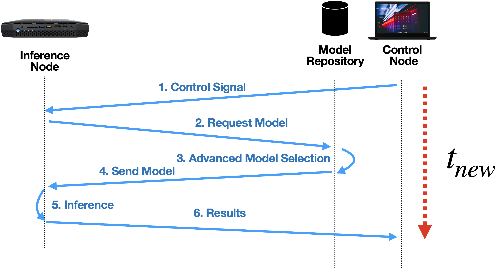

# (VnV) 경량 엣지 분석기반 추론 지연시간 개선율 (안)

- 현재 "초안" 입니다.


---------------------------------------------------
## 문서의 개요
- 본 문서는 개발한 cloud-edge-framework 를 기반으로 VnV(Verification and Validation)를 수행하기 위한 절차 및 관련 코드를 설명합니다.

## 요약
- 이기종의 에지 디바이스 연동 플랫폼 성능을 검증하고자 합니다.
- 연동 플랫폼의 성능은 추론 지연시간을 측정하여 정량적으로 평가합니다.


---------------------------------------------------
## 평가시 고려사항 (사업계획서)

### 기본 인프라

- [출처: 사업계획서] 추론(분석)으로 인해 발생하는 종단 간 지연시간의 평균 개선율을 측정하기 위해 다음과 같이 클라우드-엣지 환경을 설정합니다.

### 평가 환경 및 조건

- [출처: 사업계획서] 이기종의 네트워크 대역폭 및 불안정한 Backgroud Utilization 환경을 고려하며, 엣지 단독 추론 및 병행추론 등 다양한 유형의 분석 방식 채택 가능합니다.

### 기준 알고리즘
- [출처: 사업계획서] 주어진 태스크와 목적에 부합하는 딥러닝 모델 중 가장 우수한 정확도를 제공하는 모델을 엣지 추론을 위한 모델로 선정하는 Greedy Model Selection Algorithm을 기준 알고리즘으로 선정합니다.

### 추론 Budget
- [출처: 사업계획서] 엣지 추론을 위해 모델 선별 시 허용 가능한 추론 지연시간을 일종의 예산(Budget)개념으로 활용합니다.


---------------------------------------------------
## (KETI 초안) 시험 방법

- 에지 환경 추론에 따른 성능 개선을 확인하기 위해, 성능 확인에 영향을 주는 변인들은 가급적 통제하여 평가를 실시합니다.
- 상세하게는 다음과 같은 2가지 시험 구성 {Baseline, Proposed}에 따라 평가를 진행합니다.
- {Baseline}과 {Proposed}의 시험 구성에 따른 추론 지연시간을 각각 $t_{ref}$, $t_{new}$ 와 같이 측정합니다.
- 이를 비교하여 추론 지연시간 개선율을 계산합니다.

$$  \Delta {t} = \frac{1}{n} \sum_{i=1}^{n} \frac{ t_{ref} -  t_{new} }{ t_{ref} } $$

- {Baseline}과 {Proposed}의 주요 차이점은 추론 모델 선택에 있습니다.
- (1) {Baseline}은 가용 모델 중, 가장 성능이 우수한 분석 모델을 선택하는 <b>{Greedy Model Selection}</b> 을 사용합니다.
- (2) {Proposed}는 장치의 {연산량, 연산자원, 네트워크 대역폭} 등을 고려하여 10% 이내의 정확도 열화를 감내하는 선에서 Latency Budget을 계산하여 추론 모델을 선택하는 <b>{Advanced Model Selection}</b> 을 사용합니다. 
- 상기 2가지 시험 구성을 분리하여 설명했으나, 세부 시험 구성요소는 변인통제를 위해 서로 공유가 가능합니다.
- 일례로, {Framework Node, Inference Node, Data Source Node}는 추론지연시간 측정을 위해 그 기능을 공유합니다.
- {Data Source Node}는 변인통제가 필요하지만, 현장 시나리오를 가정하여 개념도에 추가했으녀, 추론하고자 하는 데이터를 {Inference Node}에서 캐싱(cashing)하여 처리하는 것이 바람직합니다.


### 시험 구성 1 (Baseline)

- {Baseline}에서는 종래의 가장 성능이 우수한 모델을 선택하는 방식을 사용하는 {Greedy Model Selection} 방법을 사용하는 것을 특징으로 합니다.
- 주요 시험 구성요소는 다음과 같습니다.
- Framework Node (프레임워크 노드) : {MacbookPro14} --> <b>{Greedy Model Selection}</b> 적용
- Inference Node (추론 노드) : {NUC GPU Edge Device}
- Data Source Node : {RPI or Synology NAS}


### 시험 구성 2 (Proposed)
- {Proposed}에서는 장치의 {연산량, 연산자원, 네트워크 대역폭} 등을 고려하여 10% 이내의 정확도 열화를 감내하는 선에서 Latency Budget을 계산하여 추론 모델을 선택하는 {Advanced Model Selection}을 사용하는 것을 특징으로 합니다.
- 주요 시험 구성요소는 다음과 같습니다.
- Framework Node (프레임워크 노드) : {MacbookPro14} --> <b>{Advanced Model Selection}</b> 적용
- Inference Node (추론 노드) : {NUC GPU Edge Device}
- Data Source Node : {RPI or Synology NAS}




### 사용 Dataset

- 아래의 Cifar10 데이터셋에서 일부를 추출하여 평가에 활용합니다.

```bash
  . https://www.cs.toronto.edu/~kriz/cifar.html

  . Cifar10 : 32x32 컬러 이미지, 10개의 분류객체, 클래스당 6000장(5000장 학습, 1000장 시험), 총 60000장(50000장 학습셋 + 10000장 시험셋)
```


### 사용 모델

- Resnet 모델을 고려 중입니다. (Resnet 모델 테스트 완료후, VGG, Yolo 계열의 모델을 추가할 계획입니다. 향후 지식증류 모델을 적용하는 것도 고려할 수 있습니다.)
- 일례로, {Baseline}실험은 RESNET101을 사용했다면, {Proposed}에서는 RESNET18을 사용하여 모델 전송에 드는 오버헤드를 줄이고, 추론시간을 줄이는 전략을 적용합니다.

- 참고 자료 출처 : https://pytorch.org/hub/pytorch_vision_resnet/

```csv
Model structure,	Top-1 error,	Top-5 error
resnet18,	30.24,	10.92
resnet34,	26.70,	8.58
resnet50,	23.85,	7.13
resnet101,	22.63,	6.44
resnet152,	21.69,	5.94
```


- 참고 자료 출처 : https://github.com/albanie/convnet-burden

```csv
model,	input size,	param mem
resnet18,	224 x 224,	45 MB
resnet34,	224 x 224,	83 MB
resnet-50,	224 x 224,	98 MB
resnet-101,	224 x 224,	170 MB
```


-------------------------------------------

## (TODO) 장치별 기초 실험 

### Cifar10 데이터셋에 대한 에지 기기별 동작 유무, 시간

- 수행 시간 및 정확도 (TX2의 경우 VGG19 inference)

```csv

model, RTX3080ti(GPU), RTX3080ti(CPU), TX2(CPU), RPI(CPU)
VGG19, 1.194, 35.162
SimpleDLA, 1.276, 
resnet18,	,
resnet34,	,
resnet-50,	,
resnet-101, ,
```


### (참고) 임베디드 디바이스별 분석모델 처리 속도

- 그림 출처 : https://qengineering.eu/deep-learning-with-raspberry-pi-and-alternatives.html


### 주요 참고문헌

```bibtex
@article{mathur2021device,
  title={On-device federated learning with flower},
  author={Mathur, Akhil and Beutel, Daniel J and de Gusmao, Pedro Porto Buarque and Fernandez-Marques, Javier and Topal, Taner and Qiu, Xinchi and Parcollet, Titouan and Gao, Yan and Lane, Nicholas D},
  journal={arXiv preprint arXiv:2104.03042},
  year={2021}
}

@article{liu2022unifed,
  title={UniFed: A Benchmark for Federated Learning Frameworks},
  author={Liu, Xiaoyuan and Shi, Tianneng and Xie, Chulin and Li, Qinbin and Hu, Kangping and Kim, Haoyu and Xu, Xiaojun and Li, Bo and Song, Dawn},
  journal={arXiv preprint arXiv:2207.10308},
  year={2022}
}
```